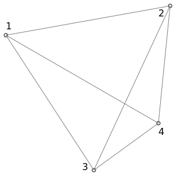

# Simplex

A simple is the most basic linear polytope in a $d$ dimensional space. In 1D this is a line segment, in 2D this is a triangle, in 3D this is a tetrahedron.

In these derivations the right-hand rule is used, as well as a right-handed coordinate system.

## Volume

Then general form for the volume of a simple in $d$ dimensional space is computed using the determinant of matrix where the columns are the determinant basis vectors. Note that this and the following forms are the signed volume and require deliberate vertex ordering to achieve the required results.

$vol(\{\vec{x}_{j\in [1,d]}\})=\frac{1}{d!}det(\begin{bmatrix}(\vec{x}_2-\vec{x}_1) & .. & (\vec{x}_d-\vec{x}_1)\end{bmatrix})$

In 1D, the volume is derived geometrically as the length of line segment:

$vol(\{\vec{x}_1,\vec{x}_2)=(\vec{x}_2-\vec{x}_1)$

In 2D, the volume is derived geometrically as 1/2 base times height:

$vol(\{\vec{x}_1,\vec{x}_1)=\frac{1}{2}(\vec{x}_1-\vec{x}_2)\cdot\vec{n}(\vec{x}_{j\in[2,3]})vol(\{\vec{x}_{j\in [2,3]}\})$

In 3D, the volume is derived geometryically as 1/2 base times height:

$vol(\{\vec{x}_{j\in [1,4]}\})=\frac{1}{3}(\vec{x}_1-\vec{x}_2)\cdot\vec{n}(\{\vec{x}_{j\in [2,4]}\})vol(\{\vec{x}_{j\in [2,4]}\})$

In ND, noting that pattern from above, this extends to:

$vol(\{\vec{x}_{j\in [1,d]}\})=\frac{1}{d}(\vec{x}_1-\vec{x}_2)\cdot\vec{n}(\{\vec{x}_{j\in [2,d]}\})vol(\{\vec{x}_{j\in [2,d]}\})$

## Face Normal

In 1D we rotate the basis vector by $\pi/2$.

$\vec{n}({\vec{x}_{j\in[1,2]}})=\begin{bmatrix}0 & -1 \\ 1 & 0\end{bmatrix}\frac{\vec{x}_1-\vec{x}_2}{|\vec{x}_1-\vec{x}_2|}$

In 3D we use the cross product of the 2 basis vectors.

$\vec{n}(\{\vec{x}_{j\in [1,3]}\})=\frac{(\vec{x}_3-\vec{x}_2)\times(\vec{x}_4-\vec{x}_2)}{|\vec{x}_3-\vec{x}_2||\vec{x}_4-\vec{x}_2)|}$

## Linear Interpolation

$f(x)=\displaystyle\sum_i f_i\alpha_i(x)$

$\alpha_i(\vec{x})=\frac{vol(\vec{x},\{\vec{x}_{j!=i}\})}{vol(\{\vec{x}_j\})}$

## Gradient

$(\nabla f(x))_j=\frac{\partial f(x)}{\partial x_j}=\displaystyle\sum_i f_i\frac{\partial\alpha_i(x)}{\partial x_j}$

From the Matrix Cookbook we have one way to compute the gradient. However, this requires extensive algebra to work through.

$\frac{\partial det(A)}{\partial x}=det(A)Tr(A^{-1}\frac{\partial A}{\partial x})$

Instead, it's simpler to derive it geometrically. The volume can also be defined as (using vertex $i$ as a reference vertex):

$\newcommand{\jni}{{j\in [1,d]\backslash i}}$
$\newcommand{\ipo}{{i\%d+1}}$

$vol(\{\vec{x}_{j\in [1,d]}\},i)=\frac{1}{d}(\vec{x}_i-\vec{x}_{i\%d+1})\cdot\vec{n}(\{\vec{x}_\jni\}) vol(\{\vec{x}_\jni\})$

At this point we can easily take the derivative of the volume with respect to $\vec{x}_i$, and substitute this back into the gradient formula for the basis function, and then compute the net gradient for the tetrahedron.

$a_i(\vec{x})=\frac
{\frac{1}{3}(\vec{x}-\vec{x}_\ipo)\cdot\vec{n}(\{\vec{x}_\jni\}) vol(\{\vec{x}_\jni\})}
{\frac{1}{3}(\vec{x}_1-\vec{x}_\ipo)\cdot\vec{n}(\{\vec{x}_\jni\}) vol(\{\vec{x}_\jni\})}$

$a_i(\vec{x})=\frac
{(\vec{x}-\vec{x}_\ipo)\cdot\vec{n}(\{\vec{x}_\jni\})}
{(\vec{x}_i-\vec{x}_\ipo)\cdot\vec{n}(\{\vec{x}_\jni\})}$

$\nabla\alpha_i(\vec{x})=\frac
{\vec{n}(\{\vec{x}_\jni\})}
{(\vec{x}_i-\vec{x}_\ipo)\cdot\vec{n}(\{\vec{x}_\jni\})}$


## 3D Tetrahedron



Vertex orders to create inward facing normals (reverse to get outward face normals):
- 4: 1,2,3
- 1: 2,4,3
- 2: 3,4,1
- 3: 4,2,1


## Normalization

$$f(\vec{x})=\frac{\vec{x}}{|\vec{x}|}=\vec{x}(\vec{x}^T\vec{x})^{-\frac{1}{2}}$$

$$\frac{\partial f(\vec{x})_i}{\partial x_j}
=\delta_{ij}(\vec{x}^T\vec{x})^{-\frac{1}{2}}-x_i\frac{1}{2}(\vec{x}^T\vec{x})^{-\frac{3}{2}}2x_j$$

$$=\delta_{ij}(\vec{x}^T\vec{x})^{-\frac{1}{2}}-x_i x_j(\vec{x}^T\vec{x})^{-\frac{3}{2}}$$

In vector form:
$$\frac{\partial f(\vec{x})}{\partial\vec{x}}=I(\vec{x}^T\vec{x})^{-\frac{1}{2}}-\vec{x}\vec{x}^T(\vec{x}^T\vec{x})^{-\frac{3}{2}}$$
$$=\frac{I}{|x|}-\frac{\vec{x}\vec{x}^T}{|x|^3}$$

Sympy code for verification:
```
X=sympy.matrices.MatrixSymbol("X",3,1)
(X/(X.T*X)**(1/2)).as_explicit().jacobian(X)
```

## Node Centered Laplacian Equation

### Median dual volume discretization

In this case we construct a volume around each node using the centers of adjacent simplexes (edges and cell centers in 2D; edges, face centers and cell centers in 3D) to form a face between each node and its neighbors.

<svg width="300" height="300" xmlns="http://www.w3.org/2000/svg" style="background-color:white">
    <polygon points="10,60 290,10 160,290" style="fill:transparent;stroke:gray;stroke-width:1" />
    <!--nodes/-->
    <circle cx="10" cy="60" r="3" stroke="black" stroke-width="1" fill="white" />
    <circle cx="290" cy="10" r="3" stroke="black" stroke-width="1" fill="white" />
    <circle cx="160" cy="290" r="3" stroke="black" stroke-width="1" fill="white" />
    <!--centroid/-->
    <circle cx="153.333" cy="120" r="3" stroke="black" stroke-width="1" fill="white" />
    <!--edge midpoints/-->
    <circle cx="150" cy="35" r="3" stroke="black" stroke-width="1" fill="white" />
    <circle cx="225" cy="150" r="3" stroke="black" stroke-width="1" fill="white" />
    <circle cx="85" cy="175" r="3" stroke="black" stroke-width="1" fill="white" />
    <!--first point interior faces/-->
    <line stroke-dasharray="5, 5" x1="153.333" y1="120" x2="150" y2="35" stroke="grey"/>
    <line stroke-dasharray="5, 5" x1="153.333" y1="120" x2="85" y2="175" stroke="grey"/>
    <!--first point interior face normals/-->
    <line stroke-dasharray="5, 5" x1="151.666" y1="77.5" x2="195.166" y2="75.833" stroke="grey" stroke-linecap="butt"/>
    <line stroke-dasharray="5, 5" x1="119.1666" y1="147.5" x2="153.333" y2="181.666" stroke="grey" stroke-linecap="butt"/>
  <line />
</svg>

### Confinement dual volume discretization (Voronoi)

In this case we use the Voronoi cell for the node as its volume. Note that this only non-degenerate for Delaunay triangulations. It is simpler to use in a finite volume discretization than the median dual mesh due to the orthogonality of the faces with their corresponding node-node edges. However, it is more complicated to construct and potentially less well conditioned if the mesh is close to non-Delaunay.

