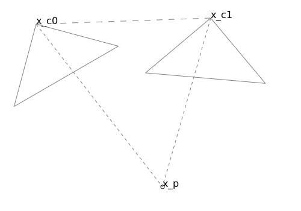
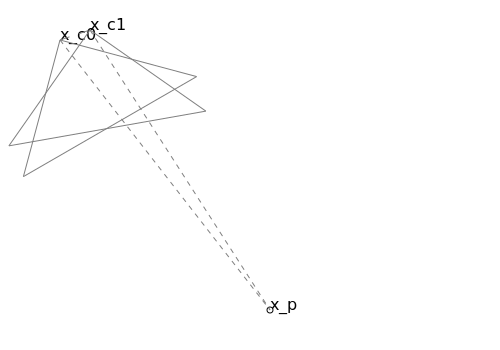

# Multiview Reconstruction

## Definitions

- Multiview Reconstruction (MVR):
- Localization/ego motion: Compute camera poses for the given images/sensor data.
- Structure from motion (SfM): Computing 3D structure, both camera poses and scene geometry from a bag of images. While "motion" might imply that the images come from a single camera stream, this is not the case.
- Simultaneous Localization and Mapping: Literally this would be the same thing as SfM, however it generally refers to the case the images do come from a single camera stream, and is also often used in realtime applications.
- Nonlinear Least Squares (NNLS)
- Iterative Reweighted Least Squares (IRLS)
- Pareto Critical Point - For a multiobjective problem, a point at which there is no direction that improves all objectives.

## Smoothing and Mapping

http://www.ananth.in/Projects/Entries/2010/12/7_Real-time_Smoothing_and_Mapping.html

## Software

- https://gtsam.org/
- LSD SLAM
- ORB SLAM 1/2/3
- Colmap
- Agisoft Metashape

### Colmap Documentation
  - IncrementalPipeline::Run is the entrypoint after feature detection/mapping
    - IncrementalPipeline::Reconstruct
      - IncrementalPipeline::ReconstructSubModel
        - IncrementalPipeline::InitializeReconstruction
          - Initializes first pair
        - while not done
          - IncrementalMapper::FindNextImages
            - IncrementalMapper::FindInitialImagePair
              - IncrementalMapper::FindFirstInitialImage
              - IncrementalMapper::FindSecondInitialImage
              - IncrementalMapper::EstimateInitialTwoViewGeometry
                - CalibratedTwoViewGeometry (two_view_geometry)
                  - Runs a bunch of LORANSAC calculations.
                  - HomographyMatrixEstimator
                    - Given the image plane points (without distortion, camera matrix applied), find the linear transformation between the views.
                - IncrementalMapper::EstimateTwoViewGeometryPose
            - IncrementalMapper::EstimateInitialTwoViewGeometry
            - IncrementalMapper::Register
          - for each image
            - IncrementalMapper::RegisterNextImage
            - IncrementalMapper::TriangulateImage
            - IncrementalMapper::IterativeLocalRefinement
            - IncrementalPipeline::IterativeGlobalRefinement

### OpenCV

OpenCV provides a number of the building blocks needed for heuristic based MV reconstruction. These include relative pose estimation (Essential Matrix estimation), 2d to 3d pose estimation (Perspective-N-Point), and calibration. It also provides robust wrappers for these that provide outlier detection and removal (e.g. RANSAC). It also provides a full MVR pipeline using libmv, however this is not maintained and does not use more recent and robust methods.

### MonoGS

https://github.com/muskie82/MonoGS

Uses the following components:
- Mixture of arbitrary parameter gaussians representation of a scene
- Localizes camera without updating map, differentiable renderer
- Updates map given camera tracking success

### Nicer-Slam

https://nicer-slam.github.io/

Uses the following components:
- Hierarchical voxel (octree) representation of scene
- ML models to one-shot predict normals and depths
- Along with a differentiable renderer applied to voxel representation
- Loss between rendering and predictions, which is optimized (TODO: is this heuristic?)

### Others

OSS
- https://github.com/Vincentqyw/Recent-Stars-2024
- https://github.com/princeton-vl/DROID-SLAM
- https://github.com/ToniRV/NeRF-SLAM
- https://huajianup.github.io/research/Photo-SLAM/
- https://github.com/DanielsKraus/SLAM-python
- https://github.com/WiseLabCMU/slam3d
- https://github.com/raulmur/ORB_SLAM2
- https://github.com/ouster-lidar/ouster-sdk
- http://robots.stanford.edu/papers/thrun.graphslam.pdf
- https://zachteed.github.io/

Companies
- https://www.spectacularai.com/
- https://www.kudan.io/our_technology/
- https://www.slamcore.com/technology/
- https://ouster.com/

Lidar/Depth systems
- https://autowarefoundation.github.io/autoware-documentation/main/how-to-guides/integrating-autoware/creating-maps/open-source-slam/

## Scene geometry representation options

Types of representations
- A physical space representation uses an explicit grid (e.g. voxels, octrees) or a point cloud to represent the scene. 
- A graph representation stores the scene as implicit geometry defined by the camera poses and depth maps (and masks). 

A physical space representation provides a lot of flexibility in terms of rendering out new frames for localizing new camera poses via a more direct photometric type approach. However, if a camera position needs to change, either due to growing error from new observations, or even a loop closure type event, these can be hard to update. On the other hand, an implicit representation based upon the camera poses/depths, can be quickly updated with a global solver.

## Baseline calculations

When calculating the position of a point or a camera using triangulation, the calculation becomes much less accurate as the triangle becomes more oblique (and less equilateral). Specifically this means that 1) the distance to the vertex with the smallest angle will have higher error, or 2) the perpendicular location of the vertex with the largest angles will have higher error.

For 2 views this is relatively straightforward since you have a single triangle as illustrated below.

Near equilateral, low error triangulation.



Oblique/high error triangulation.



For multiple views of the same point, this becomes much less well-defined. One could loop over all the camera pairs and compute this. But this is $O(n^2)$ and inefficient. Instead, one option is to compute some the perpendicular spread from the mean position of the cameras.


## 2 view pose estimation

See Essential and Fundamental Matrices.

- [8-Point Algorithm](https://en.wikipedia.org/wiki/Eight-point_algorithm)
- [5-Point Algorithm](https://www-users.cse.umn.edu/~hspark/CSci5980/nister.pdf)
- [Easy 5-Point Algorithm](https://users.cecs.anu.edu.au/~hongdong/new5pt_cameraREady_ver_1.pdf)
- [SRPose](https://arxiv.org/abs/2407.08199)
- [QuEst](https://github.com/KavehFathian/QuEst)

Each of these algorithms present an analytical solution to the 2 view pose estimation problem. However, they suffer from degeneracy and multiple-solutions in intermediate steps. They then require further heuristics to disambiguate the solution, but often still yield unusable results.

### 5-Point Algorithm

Epipolar constraint (TODO: explanation/reference): $$x_0^T E x_1=0$$

Where $$E=t_\times R$$.

Eigenvalue constraint (TODO: explanation): $$E E^T E-\frac{1}{2}trace(E E^T)E=0$$

Which results in 3 constraints as the off-diagonals are trivially true. As for the effect we show this as follows. We first decompose $E$ into an SVD $E=U\Sigma V^T$ and then simplify the expression.

$$U\Sigma V^T V \Sigma U^T U\Sigma V^T-\frac{1}{2}\sum_i \Sigma_{ii}^2 E=0$$

$$U\Sigma^3 V^T-\frac{1}{2}\sum_i \Sigma_{ii}^2 E=0$$

$$U\Sigma^3 V^T-U (\frac{1}{2}\sum_i \Sigma_{ii}^2\Sigma)V^T=0$$

$$\Sigma^3-\frac{1}{2}\sum_i \Sigma_{ii}^2\Sigma=0$$

This is clearly satisfied non-trivially only by $$\Sigma_{00}=\Sigma{11}$$ $$\Sigma{22}=0$$ where the 2 non-zeros is controlled by the 1/2 factor in front and squaring, where the squaring prevents cancellation and the 1/2 means that the terms must then be equal.

### QuEst

The derivation goes as follows (as taken from the text in the original paper). We start with the constraint transforming a keypoint from the second image plane in camera space to the first:

$$s_{i,1}\textbf{R}\begin{pmatrix}x_{i,1} \\ y_{i,1} \\ 1\end{pmatrix}+\vec{t}=s_{i,0}\begin{pmatrix}x_{i,0} \\ y_{i,0} \\ 1\end{pmatrix}$$

Which we rewrite with vectors:

$$s_{i,1}\textbf{R}\vec{x}_{i,1}^h+\vec{t}=s_{i,0}\vec{x}_{i,0}^h$$

Where $\vec{x}_{i,l}^h$ is the homogeneous vector of the keypoint in camera $l\in[0,1]$ of the $ith$ pair.

If we take 2 pairs, $i$ and $j$ and subtract them we eliminate $t$.

$$s_{i,1}\textbf{R}\vec{x}_{i,1}^h-s_{j,1}\textbf{R}\vec{x}_{j,1}^h=s_{i,0}\vec{x}_{i,0}^h-s_{j,0}\vec{x}_{j,0}^h$$

We can rewrite this as nullspace problem where $s$ is the vector:

$$s_{i,1}\textbf{R}\vec{x}_{i,1}^h-s_{j,1}\textbf{R}\vec{x}_{j,1}^h=s_{i,0}\vec{x}_{i,0}^h-s_{j,0}\vec{x}_{j,0}^h$$

## Homography

In computer vision a homography is a transformation that maps points from one plane to another:

Given ${x_i=x0+\alpha_0\vec{d}_0+\alpha_1\vec{d}_1}$

 This is useful when computer camera poses given points that lie on a plane in 3D space as when calibrating against a 2D pattern such as a checkerboard.

https://docs.opencv.org/4.x/d9/dab/tutorial_homography.html
https://medium.com/all-things-about-robotics-and-computer-vision/homography-and-how-to-calculate-it-8abf3a13ddc5

### Computation from image correspondances

Given a set of coplanar points in world space $\{\vec{x}_i=\vec{x}_o+u_i\vec{d}_u+v_i\vec{d}_v,i=[1,N]\}$, and their project in 2 camera spaces $\vec{x}_{i,j}=\{p(\textbf{R}_j\vec{x}_i+\vec{t}_j),i=[1,N],j=[1,2]\}$ and $p(x,y,z)=(x/z,y/z)$, we can compute the relative transformation as follows:

$$
\textbf{R}_r(s_0\begin{pmatrix}x_0 \\ y_0 \\ 1\end{pmatrix})+\vec{t}_r=(s_1\begin{pmatrix}x_1 \\ y_1 \\ 1\end{pmatrix})
$$

TODO: Add derivation

**Note that the homography calculation relies on the fact that the points are coplanar in world space. In which case the transformation from 2D camera space to 3D world space is linear despite depth unknowns.**

## Bundle Adjustment

https://www.cs.jhu.edu/~misha/ReadingSeminar/Papers/Triggs00.pdf
One of the most thorough but old papers.

https://openaccess.thecvf.com/content_ICCV_2019/papers/Zach_Pareto_Meets_Huber_Efficiently_Avoiding_Poor_Minima_in_Robust_Estimation_ICCV_2019_paper.pdf

## Camera look at derivation

Given a target $\vec{x}_t$, camera position $\vec{x}_c$, and camera up direction $\vec{d}_u$, the challenge is to derive a rotation that faces the target from the camera position, with negative y axis in the image matching the camera up direction.

TODO: THIS ISN'T ROBUST, USE 2-VECTOR TO QUATERNION FORMULA

Since the camera starts out facing down the positive z axis, we just need to rotate it such that it faces towards the target.

$$\vec{d}_t=\frac{\vec{x_t}-\vec{x_c}}{|\vec{x_t}-\vec{x_c}|}$$
$$\text{sin}(\theta_t)\vec{a}_t=\vec{d}_t\times\vec{e}_z$$
where $|\vec{d}_t|=1$. Next we need a rotation to make the camera upright. The easiest way to do this is to rotate the vector into the camera frame and then

$$\vec{\hat{d}}_{u,c}=R^{-1}(\vec{d}_t,\theta_t)\vec{d}_{u}$$

$$\vec{d}_{u,c}=\text{normalize}(\vec{\hat{d}}_{u,c}-\vec{\hat{d}}_{u,c}\vec{\hat{d}}_{u,c}^T\vec{e}_z)$$

$$\text{sin}(\theta_u)\vec{a}_u=\vec{e}_y\times\vec{d}_{u,c}$$

$$R_{lookat}=R(\vec{a}_t,\theta_t)R(\vec{a}_u,\theta_u)$$

## Research groups

- [ARIA Lab](https://www.ariarobotics.com/home)

## Incremental Structure from Motion Algorithm

```
for each image I_t:
  compute features F_t in I_t
  match features F_t against F_{0..t}
  solve for position of new camera given known points
  if unsuccessful, try solving for relative pose
  solve for position of new points
  jointly solve for all cameras/points
```

## Variable Projection Methods

- https://mi.eng.cam.ac.uk/~cipolla/archive/Publications/inproceedings/2016-ECCV-varpro.pdf
- https://www.ecva.net/papers/eccv_2024/papers_ECCV/papers/02034.pdf

## OpenCV Pinhole Camera Model

The OpenCV camera model going from world to image space is defined as follows:

$$\begin{bmatrix}X_c\\Y_c\\Z_c\end{bmatrix}=R\begin{bmatrix}X_w\\Y_w\\Z_w\end{bmatrix}+t$$

$$\begin{bmatrix}x'\\y'\end{bmatrix}=\begin{bmatrix}X_c/Z_c\\Y_c/Z_c\end{bmatrix}$$

$$\begin{bmatrix}x''\\y''\end{bmatrix}=\begin{bmatrix}x'\frac{1+k_1 r^2+k_2 r^4+k_3 r^6}{1+k_4 r^2+k_5 r^4+k_6 r^6}+2p_1 x' y'+p_2(r^2+2x'^2)+s_1 r^2+s_2 r^4 \\ y'\frac{1+k_1 r^2+k_2 r^4+k_3 r^6}{1+k_4 r^2+k_5 r^4+k_6 r^6}+p_1(r^2+2y'^2)+2p_2 x' y'+s_3 r^2+s_4 r^4 \end{bmatrix}$$

$$
s\begin{bmatrix}x'''\\y'''\\1\end{bmatrix}
=
\begin{bmatrix}
R_{33}(\tau_x, \tau_y) & 0 & -R_{13}(\tau_x, \tau_y) \\
0 & R_{33}(\tau_x, \tau_y) & -R_{23}(\tau_x, \tau_y) \\
0 & 0 & 1
\end{bmatrix}
R(\tau_x, \tau_y)
\begin{bmatrix}x''\\y''\\1\end{bmatrix}
$$

and the matrix $R(\tau_x, \tau_y)$ is defined by two rotations with angular parameter
$\tau_x$ and $\tau_y$, respectively,

$$
R(\tau_x, \tau_y) =
\begin{bmatrix}
cos(\tau_y) & 0 & -sin(\tau_y) \\
0 & 1 & 0 \\
sin(\tau_y) & 0 & cos(\tau_y)
\end{bmatrix}
\begin{bmatrix}
1 & 0 & 0 \\
0 & cos(\tau_x) & sin(\tau_x) \\
0 & -sin(\tau_x) & cos(\tau_x)
\end{bmatrix}
\begin{bmatrix}
cos(\tau_y) & sin(\tau_y)sin(\tau_x) & -sin(\tau_y)cos(\tau_x) \\
0 & \cos(\tau_x) & \sin(\tau_x) \\
sin(\tau_y) & -cos(\tau_y)sin(\tau_x) & \cos(\tau_y)\cos(\tau_x)
\end{bmatrix}
$$

$$
\begin{bmatrix}
u \\
v
\end{bmatrix} = \begin{bmatrix}
f_x x''' + c_x \\
f_y y''' + c_y
\end{bmatrix}
$$

Where

- $(X_w,Y_w,Z_w)$ are the world space coordinates
- $(X_c,Y_c,Z_c)$ are the camera space coordinate
- $(x',y')$ are the projected coordinates on the image/camera plane in camera space with implicit z=1
- $(x'',y'')$ are the distorted points (TODO: check this terminology)
- $(x''',y''')$ are the rotated points
- $(u,v)$ are the image space coordinates
- $(k_1, k_2, p_1, p_2[, k_3[, k_4, k_5, k_6 [, s_1, s_2, s_3, s_4[, \tau_x, \tau_y]]]])$ are the distortion/rotation parameters, in the order they are generally packed and made optional

## Robust Reprojection Objective Function

The typical reprojection error is as follows (which covers the the OpenCV pinhole camera model above):

$$\text{reprojection\_error}(\vec{x}_w,\vec{x}_k,\textbf{T},\textbf{d},\textbf{C})=|\vec{x}_k-\textbf{C}d(p(\textbf{T}\vec{x}_w),\textbf{d})|_2^2$$

Where

- $\vec{x}_w$ is the world coordinate of the point
- $\vec{x}_k$ is the keypoint location in the image
- $\textbf{T}$ is the camera transformation (rotation + translation)
- $p(\vec{x})=(x_0/x_2,x_1/x_2)$ projects the camera space point onto the image place in camera space (z=1)
- $d(\vec{x},\textbf{d})$ applies the distortion transform where $\textbf{d}$ are the distortion coefficients
- $\textbf{C}$ is the camera matrix scaling from normalized space to image space

One of the challenges with bundle adjustment solvers is that the objective is generally only valid for points that are within the camera [frustum](https://en.wikipedia.org/wiki/Frustum). More specifically there are 2 challenging cases:

1. Non-monotonic/stable distortion: For points that are in front of the camera ($Z_c$>0) then the objective above is technically computable and can be computed for points outside the frustum. However, because the distortion functions are polynomials they tend to be unbounded and invert/go to infinity very quickly outside the calibrated region. This makes the problem unnecessary non-convex/severely non-linear. This is compounded when points are near the camera and get projected to something arbitrarily far out.
2. Points behind camera: The above projection is simply not defined for points behind the camera so once a point gets stuck there, other than due to the solver making adjustments for still valid points, there's no way for most solvers to correct themselves.

For case 1 we need to do the following:
- Check when points are outside the frustum. This is complicated by the fact that the frustum is no longer pyramidal due to the distortion.
- Make the distortion function behave reasonably and continuous for points outside the frustum.

For case 2 we need to do the following:
- Extend the objective to push points back to in front of the camera.

Option 1:

If we make the assumption that the distortion function is valid within some conical valid region around the camera frustum, we can first project the point in camera space onto that cone along the the $z$ axis. The projection function would be:

$$p_c(\vec{x_c})=(x_{c,0},x_{c,1},max(x_{c,2},\frac{(x^2+y^2)^{1/2}}{\text{tan}(\theta_c)})$$

where $\theta_c$ is the angle of the cone (similar to FOV/2). Then we modify the reprojection error to use the valid region projected point, and then add a term minimizing the point between the original point in camera space and its valid projected version as follows:

$$\text{reprojection\_error}(\vec{x}_w,\vec{x}_k,\textbf{T},\textbf{d},\textbf{C})=
|\vec{x}_k-\textbf{C}d(p(p_c(\textbf{T}\vec{x}_w)),\textbf{d})|_2^2
+|\textbf{T}\vec{x}_w-p_c(\textbf{T}\vec{x}_w)|_2^2/|T\vec{x}_w|_2^2$$

Note the normalization in 

Option 2:

Change the projection mapping to extend to the unit sphere. The following paper has a similar idea, but with further refinement.

https://pdfs.semanticscholar.org/25be/7ea102fe4f8d6f0249d3a23f30ff0b3dddf5.pdf

The simplified spherical reprojection error computes the spherical position of the keypoint, and then projects the world coordinate onto the sphere, and then differences these quantities. As follows:

$$\text{spherical\_reprojection\_error}(\vec{x}_w,\vec{x}_k,\textbf{T},\textbf{d},\textbf{C})=|p_s(h(d^{-1}(\textbf{C}^{-1}\vec{x}_k,\textbf{d})))-p_s(\textbf{T}\vec{x}_w),\textbf{d}|_2^2$$

Where

- $h(\vec{x})=(\vec{x}_1,..,\vec{x}_d,1)$
- $p_s(\vec{x})=\frac{\vec{x}}{|\vec{x}|}$

The main challenge here is computing the jacobians for the inverse functions due to the lack of a closed form equation.

Given the forward function and its derivatives:

$$\vec{x}_d=d(\vec{x}_u,\textbf{d})$$

$$\frac{\partial d(\vec{x}_u,\textbf{d})}{\partial \vec{x}_u}=\frac{\partial\vec{x}_d}{\partial\vec{x}_u}\in\R^{2\times 2}$$

$$\frac{\partial d(\vec{x}_u,\textbf{d})}{\partial\textbf{d}}=\frac{\vec{x}_d}{\partial\textbf{d}}\in\R^{2\times N_d}$$

We want the following derivatives of the inverse:

$$\vec{x}_u=d^{-1}(\vec{x}_d,\textbf{d})$$

For the position derivative we can invert the forward function position derivative matrix.

$$\frac{\partial d^{-1}(\vec{x}_d,\textbf{d})}{\partial\vec{x}_d}
=\frac{\partial\vec{x}_u}{\partial\vec{x}_d}\in\R^{2\times 2}
=\left(\frac{\partial\vec{x}_d}{\partial\vec{x}_u}\right)^{-1}$$

For the distortion coefficient derivative we can compute it by expanding it using the change rule in terms of the forward derivatives and the derivatives with respect to the positions.

$$\frac{\partial d^{-1}(\vec{x}_d,\textbf{d})_i}{\partial\textbf{d}_j}
=\frac{\partial\vec{x}_{u,i}}{\partial \textbf{d}_j}
=\sum_k\frac{\partial\vec{x}_{u,i}}{\partial\vec{x}_{d,k}}\frac{\partial\vec{x}_{d,k}}{\partial \textbf{d}_j}$$
or
$$\frac{\partial d^{-1}}{\partial \textbf{d}}=\frac{\partial\vec{x}_u}{\partial\vec{x}_d}\frac{\partial\vec{x}_d}{\partial\textbf{d}}$$
Which is simply the Jacobians multiplied together.

## Avoiding Minima/Ambiguities

- Scale ambiguity
- Necker reversal
  - https://en.wikipedia.org/wiki/Necker_cube
  - Although this in theory is a not an issue with perspective projection, it manifests itself as local minima to solvers.
- Chirality ambiguity
  - A point can project to the same place when in front of or behind the camera.
- Plane-translation
- bas-relief

**Note that these ambiguities are not due to noise. You can have perfect keypoints and correspondences, and still suffer from these ambiguities and local minima.**

References:
- https://oar.princeton.edu/jspui/bitstream/88435/pr1dm4b/1/1701.08493v2.pdf
- https://openaccess.thecvf.com/content_ICCV_2019/papers/Zach_Pareto_Meets_Huber_Efficiently_Avoiding_Poor_Minima_in_Robust_Estimation_ICCV_2019_paper.pdf
- https://www.robots.ox.ac.uk/~vedaldi/assets/pubs/vedaldi07moving.pdf
  - This paper contains a thorough analysis of the SfM problem. The ultimate conclusion is that you need enough views to disambiguate the problem. Beyond that, they reason that non-physical solutions tend to have a high depth range, so that constraining/regularizing depths can correct solvers in most cases.
